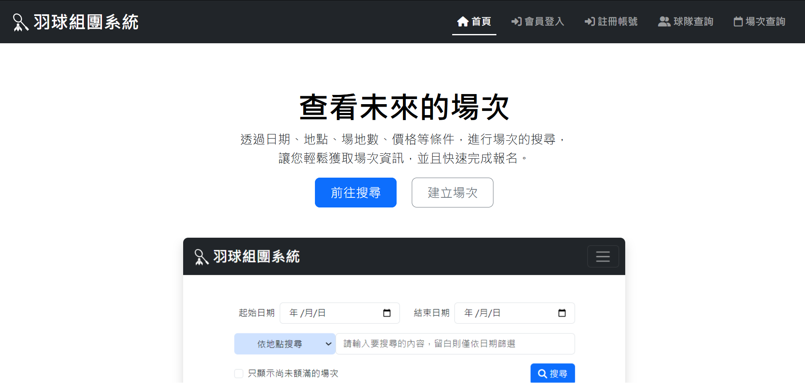

# BadmonTown 羽球組團系統

This project was designed for badminton player who looks for partners to play together. Looking up for a session to join is easy by searching at session page. Also, You can become a team leader to create a team, join team as a team member or sign up to play in a session. Besides, it is convenient to manage your related team and session at profile page.

## Table of contents 目錄

- [Overview](#overview)
  - [The challenge](#the-challenge)
  - [Screenshot](#screenshot)
  - [Links](#links)
- [My process](#my-process)
  - [Built with](#built-with)
  - [Continued development](#continued-development)
- [Author](#author)

## Overview

### The challenge

- Get familiar with React
  - Manipulate data to display for each operation
  - Router navigation and Hook
- Design data structures to store information of each user, team and session.
  - Make each collection referred to another
  - Validate data manipulation
- Set up server
  - Connect server to database
  - Design API to extract data from database
  - Validate JWT-token by Passport
- Deploy whole project to cloud
  -Backup data from local database to MongoDB Atlas
  -Deploy to Netify

### Screenshot

### Links

- Live Site URL: [BadminTown](https://badmintown.onrender.com/)

## My process

### Built with

- MongoDB
- Express.js
- React.js
- Nodejs
- Bootstrap

### Continued development

To be more practical, there should apply waiting list to application when the user enroll to be a group member or to play in the court, which may make database much more complex. Also, it will be more convenient to combine with social media to add functions like sending message and transact money, though I am still looking for App that has lower price of usage of data transfer.

## Author

- Website - [Katherine Tsai](https://github.com/ytsai4)
